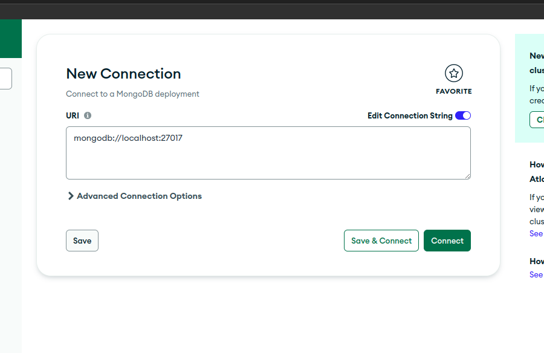
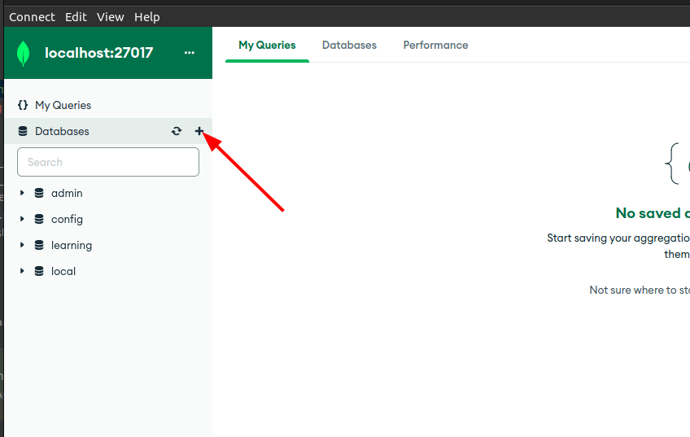
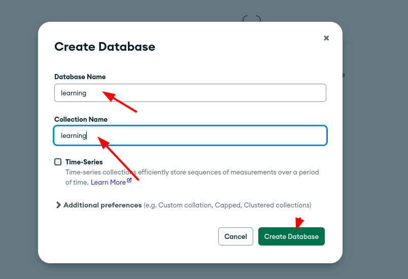
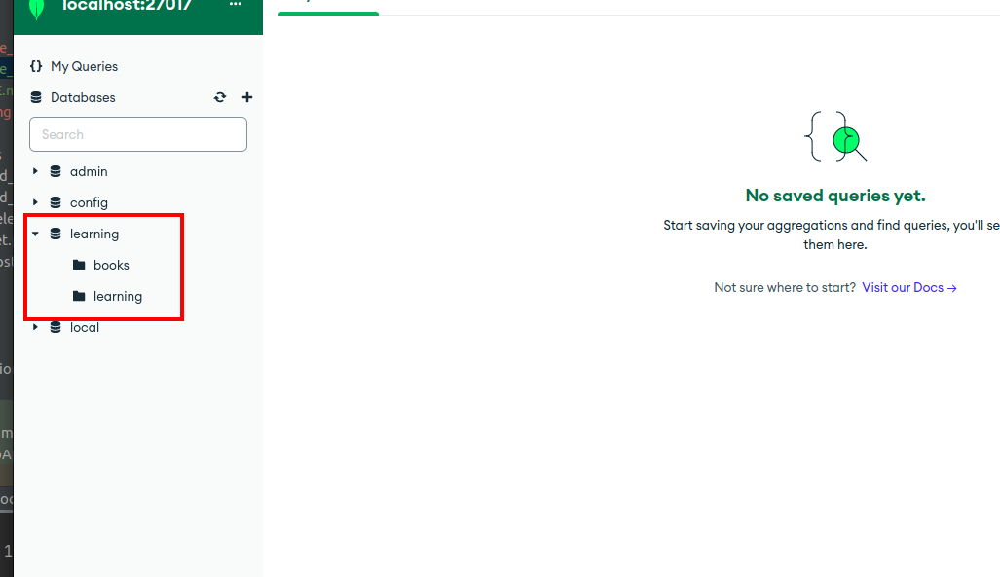

### Setup guide

- Install https://www.mongodb.com/docs/compass/master/install/
- Open app
- Click connect 

#### Default values:
- __Uri:__ mongodb://localhost:27017
- __Login/Password:__ empty

#### Database creation

##### note
books collection is based on

__Book example__
- src/main/java/com/example/demo/service/BookService.java
- src/main/java/com/example/demo/model/repository/BookRepository.java
- src/main/java/com/example/demo/service/BookServiceInterface.java
- src/main/java/com/example/demo/controller/BookController.java