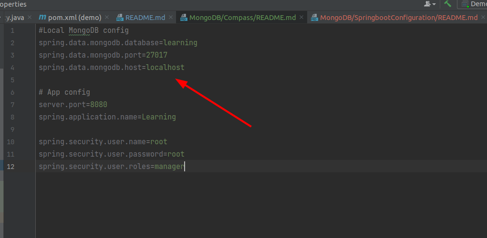

### Spring-boot configuration with mongodb

__Configuration path:__ src/main/resources/application.properties

```
#Local MongoDB config
spring.data.mongodb.database=learning
spring.data.mongodb.port=27017
spring.data.mongodb.host=localhost
```

